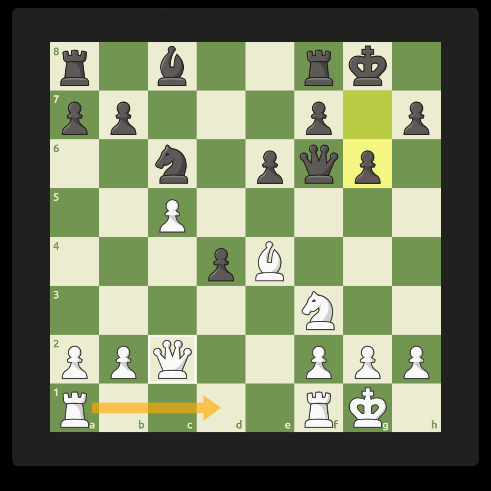

<div align="center">

# ♟️ Chess Desktop Mini

**A minimal, frameless desktop window that turns Chess.com into a floating board.**

[](https://github.com/DevGnott/ChessDesktopMini/actions/workflows/build.yml)
[](https://github.com/DevGnott/ChessDesktopMini/releases/latest)
[](LICENSE)
[](https://github.com/DevGnott/ChessDesktopMini/releases)


</div>

Chess Desktop Mini loads the real Chess.com website in a small, borderless window.
During a game it hides everything except the board, so you get a clean, always-available
chessboard you can drag into a corner of your screen while you work, watch, or stream.
The window is movable and resizable, and your Chess.com session lives in its own
persistent app profile.

<!-- SCREENSHOT: place an image at docs/screenshot.png (board-only mode is the money shot) -->
<div align="center">
  
</div>

## ✨ Features

- **Board-only mode** — the surrounding website disappears the moment a game starts; both clocks stay visible above and below the board.
- **Frameless & resizable** — drag it anywhere, size it to taste, no browser chrome.
- **Always-on-top** — keep the board floating over other windows.
- **Real Chess.com** — it's the actual site, so your account, ratings and games are exactly as usual.
- **Custom keyboard shortcuts** — rematch, new game, offer draw, resign — all rebindable.
- **Cross-platform** — Windows installer, Windows portable, and Linux AppImage.

## ⬇️ Downloads

Prebuilt downloads are available on the [GitHub Releases page](https://github.com/DevGnott/ChessDesktopMini/releases):

- Windows installer: `Chess-Desktop-Mini-Setup-<version>.exe`
- Windows portable: `Chess-Desktop-Mini-Portable-<version>.exe`
- Linux AppImage: `Chess-Desktop-Mini-<version>.AppImage`

The Windows portable edition runs without installation. Windows builds are currently unsigned, so Microsoft Defender SmartScreen may show an “unknown publisher” warning.

## 🛠️ Run from source

```bash
npm install
npm start
```

On the first launch, the full Chess.com play page is shown so you can sign in and select a game. Once a game starts, the app automatically switches to board-only mode. Both game clocks remain clearly visible above and below the board.

## 🎮 Controls

- Move the pointer to the top edge: reveal the mini toolbar
- `•••`: move the window
- `▦`: switch between board-only mode and the full Chess.com page
- `⌖`: keep the window always on top
- `⚙`: configure keyboard shortcuts
- `＋`: return to the new-game page
- Drag a window edge: resize the window
- `Ctrl+Shift+M`: toggle board-only mode

Action shortcuts work while the mini window has focus. The defaults are:

- Rematch: `Ctrl+Alt+R`
- New game: `Ctrl+Alt+N`
- Offer draw: `Ctrl+Alt+D`
- Resign: `Ctrl+Alt+Q`

Select `⚙`, click a shortcut, and press a new key combination to replace it. Changes are saved immediately. Any confirmation requested by Chess.com for draw or resign actions is preserved.

## 📦 Build packages

```bash
# Linux AppImage
npm run dist:linux

# Windows installer and portable executable
npm run dist:windows
```

Build output is written to `dist/`.

## 🔒 Privacy and trademark

The app loads the original Chess.com website and does not collect or store credentials itself. The embedded browser keeps the Chess.com session in Electron's local application data directory.

Chess.com is a trademark of Chess.com LLC. This project is independent and is not affiliated with or endorsed by Chess.com.

## 📄 License

[MIT](LICENSE) © DevGnott
